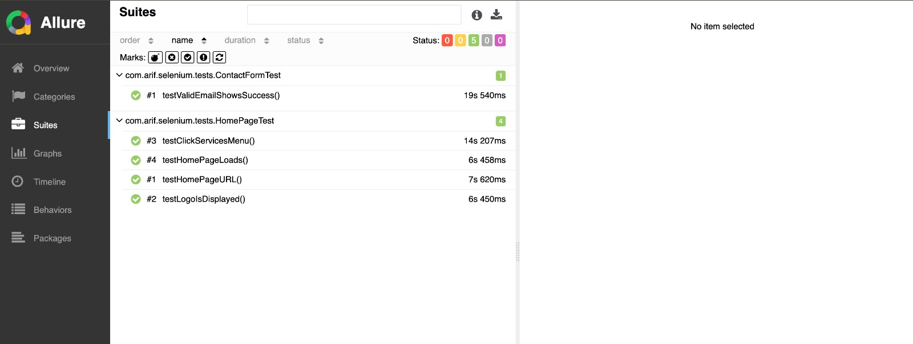
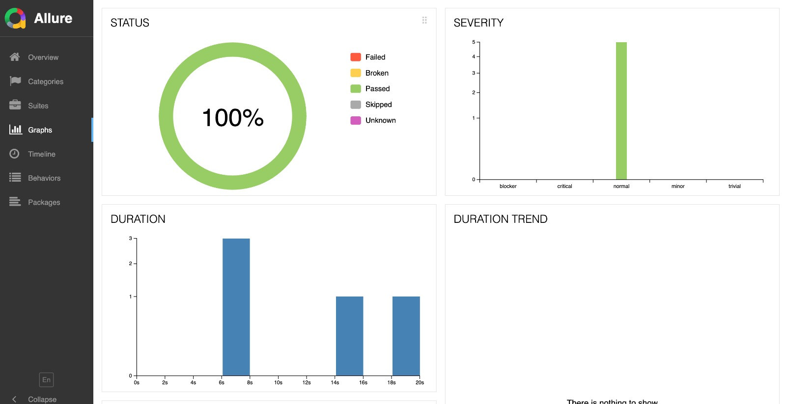
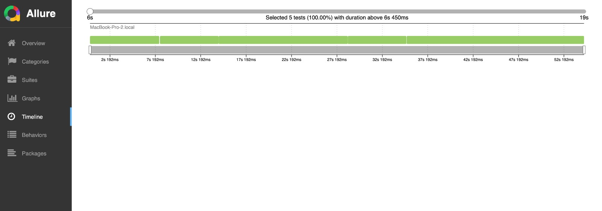
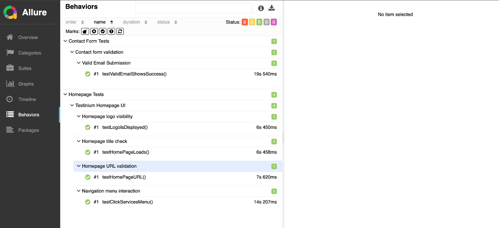

# Selenium UI Automation Java

Bu proje, Java ve Selenium WebDriver kullanarak UI otomasyon testlerini gerçekleştirmek üzere hazırlanmıştır. Test senaryoları JUnit 5 framework’ü ile yazılmıştır ve sonuçlar Allure raporlama aracı ile detaylı şekilde raporlanmaktadır.

---

## Görseller

## İçindekiler

- [Başlangıç](#başlangıç)
- [Gereksinimler](#gereksinimler)
- [Kurulum](#kurulum)
- [Testleri Çalıştırma](#testleri-çalıştırma)
- [Allure Raporu](#allure-raporu)
- [Proje Özellikleri](#proje-özellikleri)
- [Test Kapsamı](#test-kapsamı)
- [Katkıda Bulunma](#katkıda-bulunma)
- [Lisans](#lisans)

---

## Başlangıç

Bu projeyi klonlayarak kendi ortamınızda çalıştırabilirsiniz. Otomasyon testleri Maven kullanılarak yönetilmekte ve JUnit 5 ile çalıştırılmaktadır.

---

## Gereksinimler

- Java 8 veya üzeri
- Maven 3.6 veya üzeri
- Allure CLI (raporları görüntülemek için)
- İnternet bağlantısı (WebDriverManager için tarayıcı sürücülerinin indirilmesi)

---

## Kurulum

1. Projeyi klonlayın:

git clone https://github.com/kullaniciadi/selenium-ui-automation-java.git
cd selenium-ui-automation-java
Allure CLI yükleyin (daha önce yüklü değilse):

MacOS için (Homebrew kullanarak):

brew install allure
Windows ve Linux için Allure resmi dokümanlarını takip edin.

Testleri Çalıştırma
Aşağıdaki komut ile tüm testleri çalıştırabilirsiniz:

mvn clean test
Test sonuçları target/allure-results dizinine kaydedilecektir.

Allure Raporu
Testler tamamlandıktan sonra Allure raporunu oluşturmak ve görüntülemek için:

allure serve target/allure-results
Bu komut, raporu oluşturur ve tarayıcıda otomatik olarak açar.

Alternatif olarak, raporu oluşturup statik dosya olarak da oluşturabilirsiniz:

allure generate target/allure-results -o target/site/allure-report --clean
Sonrasında raporu web sunucuya koyup veya doğrudan açabilirsiniz.

Proje Özellikleri
Selenium WebDriver 4.20.0: Modern ve güçlü web otomasyon kütüphanesi.

JUnit 5: Test senaryolarının yazımı ve yürütülmesi için güncel test framework.

WebDriverManager: Tarayıcı sürücülerini otomatik indirme ve yönetme.

Allure Report: Test sonuçlarının detaylı ve şık görselleştirmesi.

Temiz ve modüler test sınıfları: Kolayca test ekleme ve yönetme imkanı.

Test Kapsamı
Ana Sayfa Testleri: Site başlığının doğrulanması, logo görünürlüğü, menü ve linklerin çalışması.

İletişim Formu Testleri: geçersiz e-mail ile contact us bileşeni , doğrulama mesajlarının kontrolü.

Katkıda Bulunma
Katkılarınız için teşekkür ederiz!
Fork yapabilir, yeni testler ekleyebilir, hataları düzeltebilir veya iyileştirmeler yapabilirsiniz.
Pull request açarken açıklayıcı olmanız işimizi kolaylaştıracaktır.

